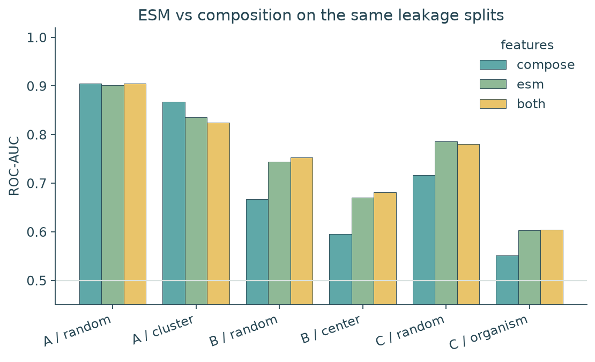
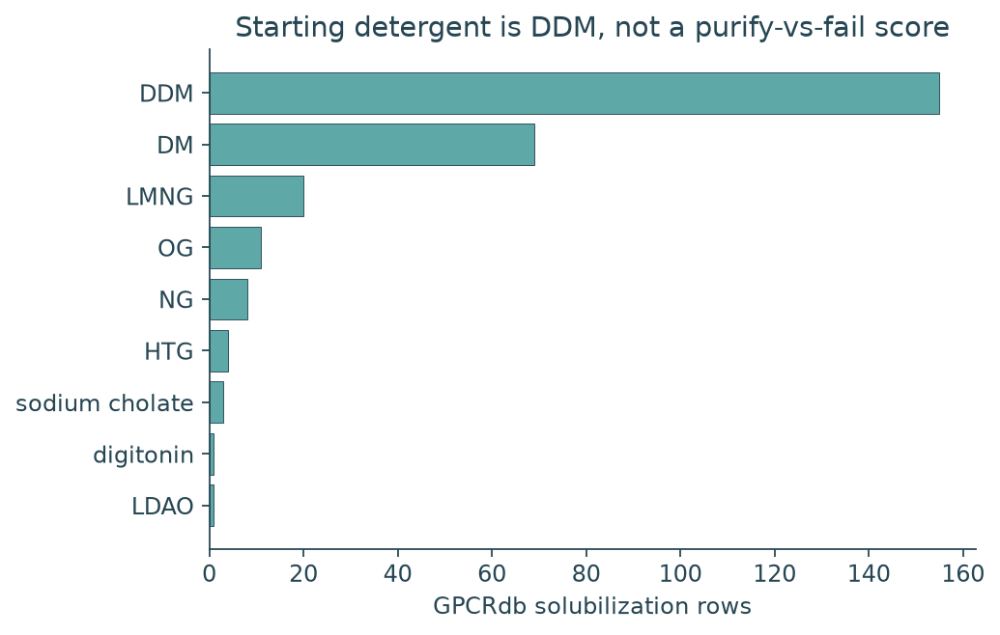

# mp-atlas

**Cellular expression is not HTS-studyable material — and sequence models of that gap mostly learn family, center, or organism.**

This repo measures the membrane-protein HTS funnel on public catalogs: Curnow FACS (question A), PSI TargetTrack membrane-center production (B), GPCRdb construct recipes plus four published detergent screens (B-conditions; PurificationDB is still missing), and mpstruc vs Swiss-Prot TM (C). The questions are never pooled. There is no public 1000-protein FSEC table; TargetTrack `purified` is the large B proxy, not a substitute for FSEC-TS. Detergent rows are a starting prior, not a purify-vs-fail label.

Pre-registered contract: [`ANALYSIS.md`](ANALYSIS.md). Package: `mp-atlas` / `mpatlas`.


[](LICENSE)
[](demo/)

---

## The problem

If you put ~1000 membrane proteins into a cell, fluorescence is an early gate. What you actually need is protein that can be extracted, stay monodisperse, and be studied. Public data make it easy to train one “expression” classifier on mixed labels. That is the wrong object.

**How much of an apparent sequence model of expression, purification, or “solved structure” is family / center / organism leakage rather than a transferable HTS prior?**

---

## What this repo builds

1. **Ingest** TargetTrack membrane-center trials, UniProt Swiss-Prot TM, mpstruc, the full Curnow library, GPCRdb construct Excel, Högbom/Kotov/Lin/Lantez catalogs, and PurificationDB / UniTmp when those dumps resolve
2. **Gate 0 census** — n at every layer, stop rules for B / B-conditions / C, before any AUC
3. **Features** — composition, Kyte–Doolittle TM belt, termini, loop charge, sequons; ESM-2 650M mean-pool on the same leakage splits when `data/processed/esm2_650m.npz` exists
4. **Models** — logreg + RF on A, on B (purified | cloned), and on C vs Swiss-Prot TM, under random vs leakage splits
5. **Playbook** — given expression, recommend `standard` / `wrap_rescue` / `redesign` / `deprioritize`, then attach a DDM±CHS extract prior
6. **WRAP amenability** — a rescue heuristic on B-failures, not a design engine

<p align="center">
  
</p>

<p align="center"><em>Figure 1. Composition features: Curnow FACS looks easy on a random split (RF 0.90). TargetTrack purification and “looks like a solved MP” are weaker even at random, and collapse further under center and organism holdout. ESM on the same splits is Figure 5.</em></p>

---

## Key results

| Check | Result |
|-------|--------|
| Curnow labelled FACS (A, one scaffold) | **2,176** · 1,122 bright / 1,054 dim |
| Curnow library sequences (labelled + unlabelled) | **13,551** unique |
| TargetTrack membrane-center unique targets (B) | **20,583** |
| Funnel (latest status, cumulative) | selected 20,363 → cloned 6,747 → expressed 5,308 → soluble 3,364 → **purified 2,299** → in PDB 83 |
| P(purified \| cloned) | **0.34** (2,299 / 6,747) |
| Centers with ≥1 purified | 11 (CSMP 1,099 · NYCOMPS 745 · others) |
| Swiss-Prot TM background (C) | **80,943** |
| mpstruc unique PDB IDs | **4,285** · 2,200 Swiss-Prot TM join positives |
| PurificationDB / PDBTM bulk | **n = 0** (dumps unreachable) |
| TOPDB (local XML) | **9,558** entries, all with sequence · **7,579** PDB xref · median n_TM **3** |
| Daley 2005 GFP (A transfer) | **579** · median GFP/ml split · **428** joined to Swiss-Prot TM E. coli |
| Hammon 2009 GFP (A transfer) | **313** sequences (UniProt + NCBI) · **64** FSU ≥ 60,000 |
| ESM-2 650M universe | **101,807** unique sequences (Swiss-Prot TM + Curnow + TOPDB + TargetTrack) |
| GPCRdb construct recipes (B-conditions) | **1,289** rows · **442** solubilization · **268** unique PDBs |
| GPCRdb solubilization detergents | DDM **155** · DM **69** · LMNG **20** · OG **11**; additive CHS **150** |
| Mode extract combo | **DDM+CHS** on **122** PDBs |
| Högbom 2017 FSEC screen | **60** E. coli GFP MPs × **16** detergents (family-level claims; Table 2 is a figure) |
| Kotov 2019 nanoDSF | **9** IMPs × **94** detergents; maltose-NG stabilize transporters; fos-choline/PEG unfold |
| Lin 2016 FA-SEC | **n = 2** (ASBTNM, HiTehA); **1%** DDM extract, **0.03%** DDM IMAC/SEC |
| Lantez 2015 His-tag screen | **n = 31**; winners DDM, DM, DMNG, TX-100, LAPAO, Fos-12 (no public per-protein table) |
| Gate 0 stop | A **fit_local** · B **fit** · B-conditions **prior** · C **fit** |
| A random-split RF ROC-AUC (compose) | **0.904** |
| A Hamming-cluster RF / logreg (compose) | **0.868** / **0.783** (cluster test n=85) |
| A Hamming-cluster logreg / RF (ESM-2 650M) | **0.883** / **0.835** |
| B random-split RF (compose / ESM / both) | **0.667** / **0.744** / **0.753** |
| B center-holdout RF (train NYCOMPS) | **0.596** compose · **0.670** ESM · **0.681** both |
| C random-split RF (compose / ESM) | **0.716** / **0.785** |
| C organism-holdout RF (eukaryote test) | **0.552** compose · **0.603** ESM |
| Curnow → Daley GFP transfer (n=428) | RF compose **0.534** · best **0.570** (logreg, both) |
| Curnow → Hammon GFP transfer | chance or worse (compose RF **0.441** on n=313) |
| Playbook P(purified \| expressed) random RF | **0.658** |
| Same, center holdout RF | **0.514** (chance after lab switch) |
| Next-step mix on 800 expressed-not-purified | standard **193** · WRAP rescue **197** · redesign **272** · deprioritize **138** |

Artifacts: [`reports/gate0.json`](reports/gate0.json), [`reports/curnow_leakage.csv`](reports/curnow_leakage.csv), [`reports/purified_leakage.csv`](reports/purified_leakage.csv), [`reports/structure_leakage.csv`](reports/structure_leakage.csv), [`reports/gfp_transfer.csv`](reports/gfp_transfer.csv), [`reports/playbook_panel.csv`](reports/playbook_panel.csv), [`reports/gpcrdb_detergents.csv`](reports/gpcrdb_detergents.csv).

---

## Quick start

Requires **Python 3.11+**. Offline demo uses the committed Curnow labels (or a synthetic fixture if that CSV is missing):

```bash
python3.11 -m venv .venv && source .venv/bin/activate
pip install -e ".[dev]"
mpx-demo
# or: bash scripts/reproduce.sh
```

Full catalogs (TargetTrack tarball, UniProt stream, mpstruc XML):

```text
mpx-download → mpx-census → mpx-express → mpx-playbook
```

---

## The funnel

TargetTrack statuses are an ordered production ladder, not fluorescence. Membrane-center trials (NYCOMPS, CSMP, GPCR, …) are kept; soluble-protein centers are dropped. Latest status per (target, sequence); later ranks count as having reached the earlier steps.

<p align="center">
  
</p>

<p align="center"><em>Figure 2. Of 6,747 cloned membrane-center targets, 2,299 reached purified and 83 reached PDB. Expression is not the scarce step; studyable material is.</em></p>

This is **not** FSEC. Center protocols differ (CSMP vs NYCOMPS purified counts are not the same experiment).

---

## Leakage splits

Random split is the optimistic control. Primary claims use Hamming clusters on Curnow, TargetTrack **center** holdout (NYCOMPS vs other membrane centers), and Swiss-Prot **organism domain** (eukaryote vs prokaryote).

<p align="center">
  
</p>

<p align="center"><em>Figure 3. Local A: RF stays high on neighborhood holdout (0.90 → 0.87). Logistic regression drops more (0.89 → 0.78). The cluster test set is small (n=85).</em></p>

Curnow is combinatorial variants of one designed scaffold. Scores applied to Swiss-Prot TM or TargetTrack are out of distribution and are not reported as A skill.

---

## ESM vs composition

Mean-pooled ESM-2 650M (`facebook/esm2_t33_650M_UR50D`, 101,807 sequences) is concatenated or used alone on the **same** splits. A random-split bump that does not show up on center/organism holdout is not a better HTS prior.

<p align="center">
  
</p>

<p align="center"><em>Figure 5. ESM lifts B center-holdout RF (0.60 → 0.67) and C organism-holdout RF (0.55 → 0.60). On Curnow, cluster RF does not improve (0.87 → 0.84); cluster logreg does (0.78 → 0.88). Random-split logreg on A jumps to 0.95 and is not the claim.</em></p>

Curnow trained on FACS does not predict Daley GFP/ml (n=428, best AUC 0.57) or Hammon FSU (n=313, compose RF 0.44). That transfer is reported as transfer, not as A skill on natural proteins. Hammon ESM rows use 300/313 sequences present in the embedding index.

---

## Structure is a popularity label

mpstruc is a curated unique-protein view of solved membrane proteins (3,738 polytopic helical, 419 beta barrel, 128 monotopic). C is “resembles proteins that have been deposited,” not “will express in my host.”

<p align="center">
  
</p>

<p align="center"><em>Figure 4. Solved MPs in mpstruc are mostly polytopic helical. That is the historical set, not a random TM draw from Swiss-Prot.</em></p>

---

## What to try next

PurificationDB is still n=0. GPCRdb and the four screens supply a **starting extract**, not a yes/no purify score. The useful public question remains: **if it already expressed, should you keep going with a standard purify, switch to a WRAP-style fusion path, change the construct, or stop?** If the action is to extract, start with DDM (± CHS for 7-TM / eukaryotic).

Train P(purified | expressed) on TargetTrack membrane centers. Layer WRAP amenability and a few construct levers (too long, too many sequons, no fusion-able terminus). Four tokens only: `standard`, `wrap_rescue`, `redesign`, `deprioritize`.

Random-split RF AUC is **0.66**. Hold out NYCOMPS and test other centers: **0.51**. The sequence prior is weak once the lab changes. Treat the ranked list as a triage order, not a protocol.

<p align="center">
  
</p>

<p align="center"><em>Figure 6. Of 800 proteins that expressed but did not purify, about a quarter look like a standard retry, a quarter look WRAP-amenable, a third have an obvious construct lever, and the rest are deprioritized.</em></p>

<p align="center">
  
</p>

<p align="center"><em>Figure 7. Right of the line: try the usual purify. Left and high on WRAP: fusion/solubilizer path. Left and low: redesign or skip.</em></p>

<p align="center">
  
</p>

<p align="center"><em>Figure 8. Longer proteins and a denser TM belt track failure; cysteine count vs aa C disagree (collinear). Sequon weight is not a license to add glycans — it likely rides along with center/organism.</em></p>

Full panel: [`reports/playbook_panel.csv`](reports/playbook_panel.csv). Coefficients: [`reports/playbook_coefs.csv`](reports/playbook_coefs.csv). `mpx-playbook` writes `detergent_extract` / `detergent_polish` / `detergent_rescue` / `detergent_avoid` on each row.

---

## Starting detergent (a prior)

GPCRdb construct annotations are solved GPCRs. Högbom, Kotov, Lin, and Lantez are small published screens. None of them is a failure table. Gate 0 therefore keeps B-conditions as a **prior**, not a classifier.

Consensus first line: **~1% DDM extract → ~0.03% DDM SEC**. GPCRs add **0.2% CHS**. Rescue class is LMNG / DMNG / GDN. Kotov: fos-choline and PEG keep protein soluble while unfolding it. Lantez listed Fos-12 as a solubilization winner — that is not the same claim.

<p align="center">
  
</p>

<p align="center"><em>Figure 9. Among 442 GPCRdb solubilization rows (268 PDBs), DDM is the detergent (155) and CHS the usual additive (150). DDM+CHS is the mode combo (122 PDBs). These are crystallization successes, not a random TM draw.</em></p>

---

## WRAP rescue (not a claim)

Baker WRAPs solubilize a TM target in the E. coli cytoplasm without detergent. v1 scores **amenability** from predicted TM belt, length, and fusion-able termini. Vocabulary: `wrap_amenable` is allowed; designed WRAP and detergent-free structure are not.

<p align="center">
  
</p>

<p align="center"><em>Figure 10. Ranked B-failures (expressed/cloned, not purified). Heuristic only; ranked list in `reports/wrap_b_failures.csv`.</em></p>

---

## Limitations

- **No FSEC traces.** B is TargetTrack `purified` among cloned membrane-center targets.
- **Curnow is one scaffold.** Local A does not transfer: Daley n=428 best ROC-AUC **0.57**; Hammon compose RF **0.44**. Those are not A skill.
- **PDBTM bulk XML still 404.** TOPDB is in from a local dump (9,558). C positives remain mpstruc PDB IDs joined to Swiss-Prot `xref_pdb`.
- **PurificationDB dump was unreachable.** Buffer NER from that source is still n=0.
- **Center split shifts the base rate** (NYCOMPS train pos-rate 0.31 vs other-center test 0.69). That shift is part of the leakage result. Playbook center-holdout AUC **0.51**.
- **Detergent rows are success-biased and small outside GPCRdb.** GPCRdb is GPCRs only (268 PDBs). Högbom is 60 non-random E. coli GFP fusions; Table 2 grades were not released as a matrix. Kotov is 9 IMPs diluted from DDM into 94 detergents (residual DDM remains). Lin is n=2. Lantez is a winner list for 31 proteins, not per-target outcomes. Fos-12 is a Lantez solubilization winner and a Kotov unfolding detergent.
- ESM-2 650M is on disk (`data/processed/esm2_650m.npz`). It moves B center-holdout RF **0.60 → 0.67** and C organism-holdout RF **0.55 → 0.60**. It does not fix Curnow cluster RF or GFP transfer. 13 Hammon sequences are missing from the index.

---

## Future directions

- Newstead/Drew GFP as another A-transfer table if a machine-readable supplement exists
- PDBTM bulk XML if UniTmp resolves; recompute C without the Swiss-Prot PDB join
- PurificationDB TM slice + detergent capture rate if a dump becomes public
- Optional: PDB ligand CCDs (LMT/BOG) as *structure* detergent, not purification detergent
- Time split on PDB deposition year for C
- Pfam / TM-family holdout on natural sequences

---

## How to reproduce (detail)

| Step | Command | Writes |
|------|---------|--------|
| Offline demo | `mpx-demo` | `demo/outputs/` |
| Tests | `pytest -q` | — |
| Download | `mpx-download` (`--skip-targettrack` optional) | `data/raw/` (gitignored except `curnow_labelled.csv`) |
| Census | `mpx-census` | `reports/gate0.md`, `data/processed/*.parquet` |
| Models + figures | `mpx-express` | `reports/*_leakage.csv`, `reports/gfp_transfer.csv`, `reports/figures/` (compose + ESM if `esm2_650m.npz` exists) |
| Playbook | `mpx-playbook` | `reports/playbook_panel.csv`, `fig_playbook_*.png`, detergent prior columns |

TargetTrack is Zenodo [821654](https://zenodo.org/records/821654) (`proteinTrialSeqs.fasta.gz` inside the tarball). Swiss-Prot TM is the UniProt stream `reviewed:true AND ft_transmem:*`. mpstruc XML is from [blanco.biomol.uci.edu/mpstruc](https://blanco.biomol.uci.edu/mpstruc/listAll/mpstrucTblXml). GPCRdb construct Excel is [protwis/gpcrdb_data](https://github.com/protwis/gpcrdb_data) `construct_annotations.xlsx`. Screen catalogs live under `data/fixtures/`.

---

## Project layout

```
ANALYSIS.md          pre-registered questions, splits, stop rule
src/mpatlas/         ingest, topology, features, splits, models, playbook, WRAP, figures
tests/               XML/FASTA smoke, topology, split disjointness
demo/                offline path
reports/             Gate 0 + committed metrics and figures
data/raw/            catalogs (gitignored; keep curnow_labelled.csv)
data/fixtures/       Högbom/Kotov/Lin/Lantez, Daley, Hammon tables
```

---

## Acknowledgments

TargetTrack / PSI centers; Curnow designed library; mpstruc (White lab); UniProt; GPCRdb construct annotations; Lantez et al. 2015; Lin et al. 2016; Sjöstrand, Högbom et al. 2017; Kotov et al. 2019; PurificationDB (Garland et al. 2023) and UniTmp when those dumps are reachable.

---

## License

MIT. See [`LICENSE`](LICENSE).
