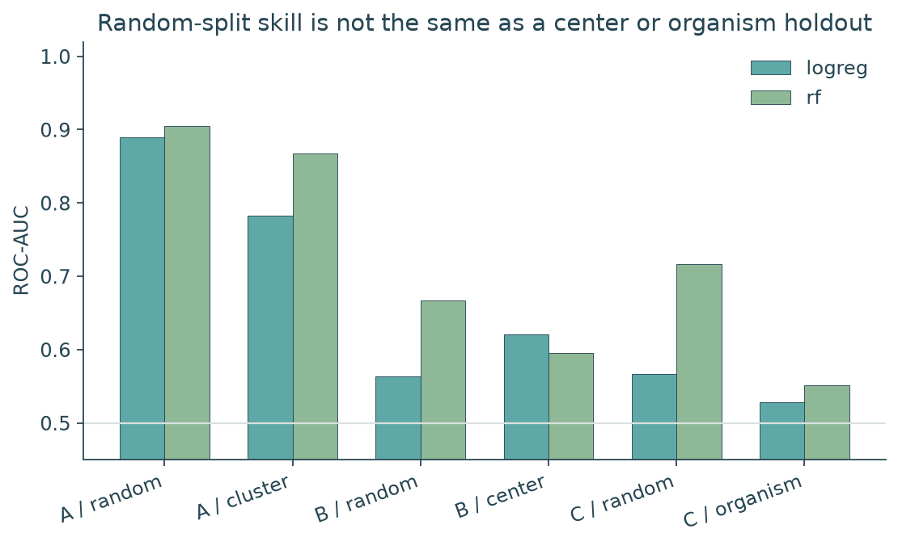
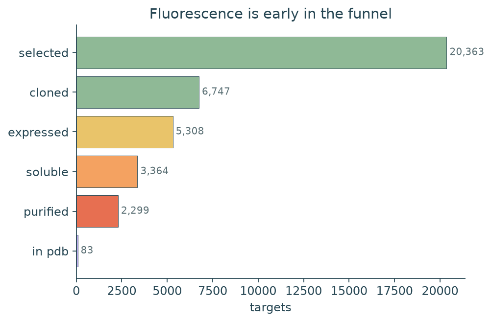
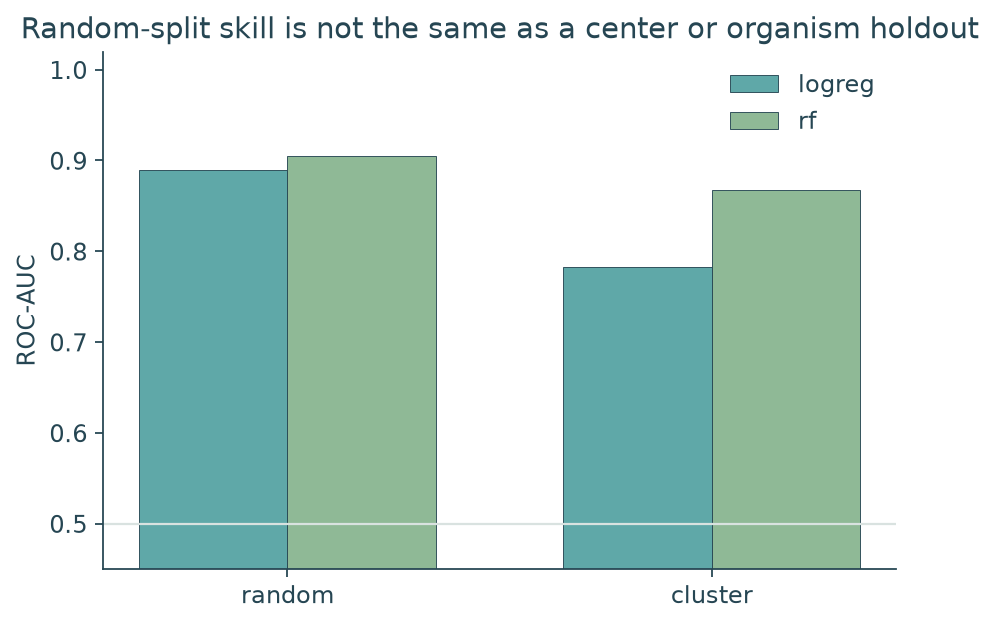
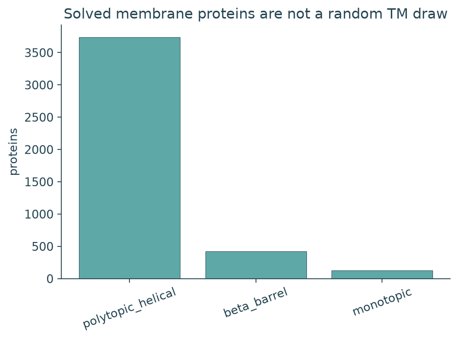
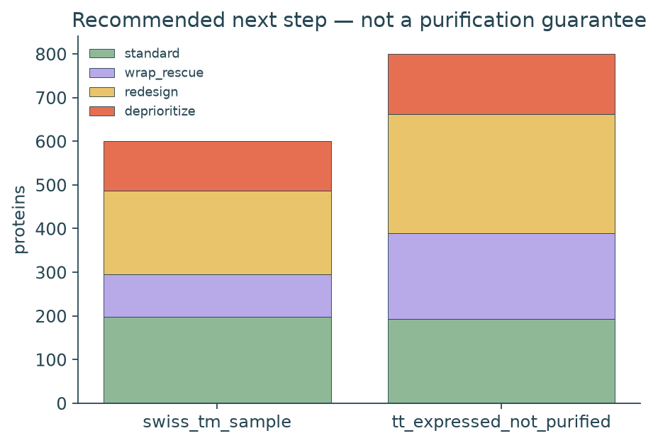
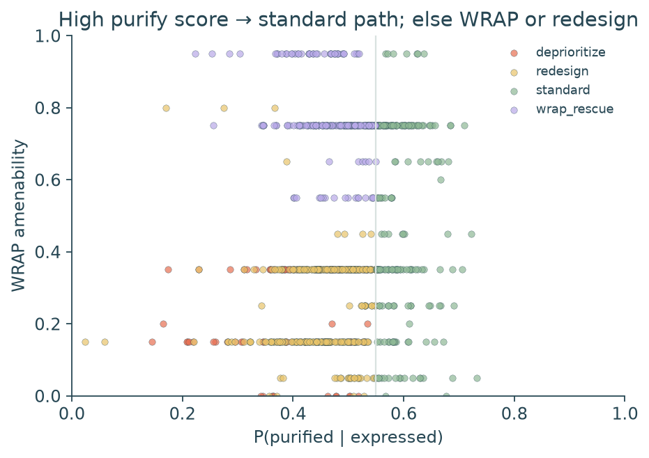
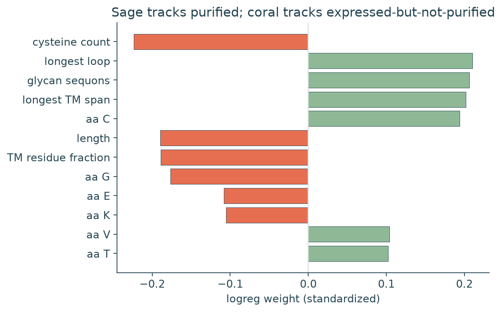
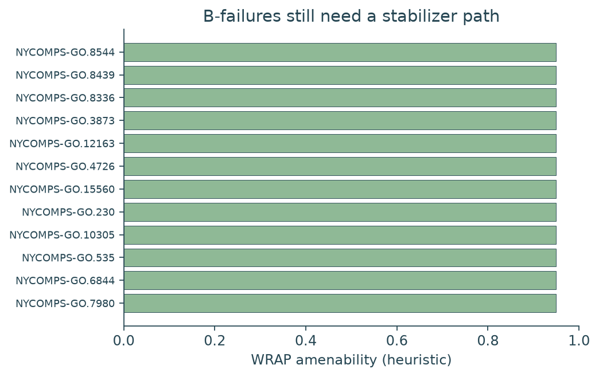

# mp-atlas

**Cellular expression is not HTS-studyable material — and sequence models of that gap mostly learn family, center, or organism.**

This repo measures the membrane-protein HTS funnel on public catalogs: Curnow FACS (question A), PSI TargetTrack membrane-center production (B), PurificationDB buffers when present (B-conditions), and mpstruc vs Swiss-Prot TM (C). The three questions are never pooled. There is no public 1000-protein FSEC table; TargetTrack `purified` is the large B proxy, not a substitute for FSEC-TS.

Pre-registered contract: [`ANALYSIS.md`](ANALYSIS.md). Package: `mp-atlas` / `mpatlas`.


[](LICENSE)
[](demo/)

---

## The problem

If you put ~1000 membrane proteins into a cell, fluorescence is an early gate. What you actually need is protein that can be extracted, stay monodisperse, and be studied. Public data make it easy to train one “expression” classifier on mixed labels. That is the wrong object.

**How much of an apparent sequence model of expression, purification, or “solved structure” is family / center / organism leakage rather than a transferable HTS prior?**

---

## What this repo builds

1. **Ingest** TargetTrack membrane-center trials, UniProt Swiss-Prot TM, mpstruc, the full Curnow library, and PurificationDB / UniTmp when the dumps resolve
2. **Gate 0 census** — n at every layer, stop rules for B / B-conditions / C, before any AUC
3. **Features** — composition, Kyte–Doolittle TM belt, termini, loop charge, sequons (CPU, no embeddings)
4. **Models** — logreg + RF on A, on B (purified | cloned), and on C vs Swiss-Prot TM, under random vs leakage splits
5. **Playbook** — given expression, recommend `standard` / `wrap_rescue` / `redesign` / `deprioritize` (not buffer recipes)
6. **WRAP amenability** — a rescue heuristic on B-failures, not a design engine

<p align="center">
  
</p>

<p align="center"><em>Figure 1. Curnow FACS looks easy on a random split (RF 0.90). TargetTrack purification and “looks like a solved MP” are weaker even at random, and collapse further under center and organism holdout.</em></p>

---

## Key results

| Check | Result |
|-------|--------|
| Curnow labelled FACS (A, one scaffold) | **2,176** · 1,122 bright / 1,054 dim |
| Curnow library sequences (labelled + unlabelled) | **13,551** unique |
| TargetTrack membrane-center unique targets (B) | **20,583** |
| Funnel (latest status, cumulative) | selected 20,363 → cloned 6,747 → expressed 5,308 → soluble 3,364 → **purified 2,299** → in PDB 83 |
| P(purified \| cloned) | **0.34** (2,299 / 6,747) |
| Centers with ≥1 purified | 11 (CSMP 1,099 · NYCOMPS 745 · others) |
| Swiss-Prot TM background (C) | **80,943** |
| mpstruc unique PDB IDs | **4,285** · 2,200 Swiss-Prot TM join positives |
| PurificationDB / PDBTM / TOPDB / GFP cohorts | **n = 0** at ingest (dumps unreachable or not shipped) |
| Gate 0 stop | A **fit_local** · B **fit** · B-conditions **lookup_only** · C **fit** |
| A random-split RF ROC-AUC | **0.904** |
| A Hamming-cluster RF / logreg | **0.868** / **0.783** (cluster test n=85) |
| B random-split RF | **0.667** |
| B center-holdout RF (train NYCOMPS, test other centers) | **0.596** |
| C random-split RF | **0.716** |
| C organism-holdout RF (eukaryote test) | **0.552** |
| Playbook P(purified \| expressed) random RF | **0.658** |
| Same, center holdout RF | **0.514** (chance after lab switch) |
| Next-step mix on 800 expressed-not-purified | standard **193** · WRAP rescue **197** · redesign **272** · deprioritize **138** |

Artifacts: [`reports/gate0.json`](reports/gate0.json), [`reports/curnow_leakage.csv`](reports/curnow_leakage.csv), [`reports/purified_leakage.csv`](reports/purified_leakage.csv), [`reports/structure_leakage.csv`](reports/structure_leakage.csv), [`reports/playbook_panel.csv`](reports/playbook_panel.csv).

---

## Quick start

Requires **Python 3.11+**. Offline demo uses the committed Curnow labels (or a synthetic fixture if that CSV is missing):

```bash
python3.11 -m venv .venv && source .venv/bin/activate
pip install -e ".[dev]"
mpx-demo
# or: bash scripts/reproduce.sh
```

Full catalogs (TargetTrack tarball, UniProt stream, mpstruc XML):

```text
mpx-download → mpx-census → mpx-express → mpx-playbook
```

---

## The funnel

TargetTrack statuses are an ordered production ladder, not fluorescence. Membrane-center trials (NYCOMPS, CSMP, GPCR, …) are kept; soluble-protein centers are dropped. Latest status per (target, sequence); later ranks count as having reached the earlier steps.

<p align="center">
  
</p>

<p align="center"><em>Figure 2. Of 6,747 cloned membrane-center targets, 2,299 reached purified and 83 reached PDB. Expression is not the scarce step; studyable material is.</em></p>

This is **not** FSEC. Center protocols differ (CSMP vs NYCOMPS purified counts are not the same experiment).

---

## Leakage splits

Random split is the optimistic control. Primary claims use Hamming clusters on Curnow, TargetTrack **center** holdout (NYCOMPS vs other membrane centers), and Swiss-Prot **organism domain** (eukaryote vs prokaryote).

<p align="center">
  
</p>

<p align="center"><em>Figure 3. Local A: RF stays high on neighborhood holdout (0.90 → 0.87). Logistic regression drops more (0.89 → 0.78). The cluster test set is small (n=85).</em></p>

Curnow is combinatorial variants of one designed scaffold. Scores applied to Swiss-Prot TM or TargetTrack are out of distribution and are not reported as A skill.

---

## Structure is a popularity label

mpstruc is a curated unique-protein view of solved membrane proteins (3,738 polytopic helical, 419 beta barrel, 128 monotopic). C is “resembles proteins that have been deposited,” not “will express in my host.”

<p align="center">
  
</p>

<p align="center"><em>Figure 4. Solved MPs in mpstruc are mostly polytopic helical. That is the historical set, not a random TM draw from Swiss-Prot.</em></p>

---

## What to try next

We do not have detergent recipes (PurificationDB n=0). The useful public question is: **if it already expressed, should you keep going with a standard purify, switch to a WRAP-style fusion path, change the construct, or stop?**

Train P(purified | expressed) on TargetTrack membrane centers. Layer WRAP amenability and a few construct levers (too long, too many sequons, no fusion-able terminus). Four tokens only: `standard`, `wrap_rescue`, `redesign`, `deprioritize`.

Random-split RF AUC is **0.66**. Hold out NYCOMPS and test other centers: **0.51**. The sequence prior is weak once the lab changes. Treat the ranked list as a triage order, not a protocol.

<p align="center">
  
</p>

<p align="center"><em>Figure 6. Of 800 proteins that expressed but did not purify, about a quarter look like a standard retry, a quarter look WRAP-amenable, a third have an obvious construct lever, and the rest are deprioritized.</em></p>

<p align="center">
  
</p>

<p align="center"><em>Figure 7. Right of the line: try the usual purify. Left and high on WRAP: fusion/solubilizer path. Left and low: redesign or skip.</em></p>

<p align="center">
  
</p>

<p align="center"><em>Figure 8. Longer proteins and a denser TM belt track failure; cysteine count vs aa C disagree (collinear). Sequon weight is not a license to add glycans — it likely rides along with center/organism.</em></p>

Full panel: [`reports/playbook_panel.csv`](reports/playbook_panel.csv). Coefficients: [`reports/playbook_coefs.csv`](reports/playbook_coefs.csv).

---

## WRAP rescue (not a claim)

Baker WRAPs solubilize a TM target in the E. coli cytoplasm without detergent. v1 scores **amenability** from predicted TM belt, length, and fusion-able termini. Vocabulary: `wrap_amenable` is allowed; designed WRAP and detergent-free structure are not.

<p align="center">
  
</p>

<p align="center"><em>Figure 9. Ranked B-failures (expressed/cloned, not purified). Heuristic only; ranked list in `reports/wrap_b_failures.csv`.</em></p>

---

## Limitations

- **No FSEC traces.** B is TargetTrack `purified` among cloned membrane-center targets.
- **Curnow is one scaffold.** Local A does not transfer by assertion; GFP-paper cohorts were not available as tables (n=0).
- **UniTmp PDBTM/TOPDB XML did not download** (host 404 / DNS). C positives are mpstruc PDB IDs joined to Swiss-Prot `xref_pdb`.
- **PurificationDB dump was unreachable.** B-conditions is census-only / lookup-only (TM slice 0). Detergent NER cannot be audited until a dump exists.
- **Center split shifts the base rate** (NYCOMPS train pos-rate 0.31 vs other-center test 0.69). That shift is part of the leakage result. Playbook center-holdout AUC **0.51**.
- **No detergent conditions.** The playbook is an experiment class, not pH/salt/DDM.
- CPU composition + Kyte–Doolittle features only. No language-model embeddings in v1.

---

## Future directions

- Parse GFP-paper supplements (Daley, Hammon, Newstead/Drew) as A-transfer tests when sequences are available
- Ingest PDBTM/TOPDB when UniTmp bulk files resolve; recompute C without the Swiss-Prot PDB join
- PurificationDB TM slice + detergent capture rate once a dump is public
- Time split on PDB deposition year for C
- Pfam / TM-family holdout on natural sequences

---

## How to reproduce (detail)

| Step | Command | Writes |
|------|---------|--------|
| Offline demo | `mpx-demo` | `demo/outputs/` |
| Tests | `pytest -q` | — |
| Download | `mpx-download` (`--skip-targettrack` optional) | `data/raw/` (gitignored except `curnow_labelled.csv`) |
| Census | `mpx-census` | `reports/gate0.md`, `data/processed/*.parquet` |
| Models + figures | `mpx-express` | `reports/*_leakage.csv`, `reports/figures/` |
| Playbook | `mpx-playbook` | `reports/playbook_panel.csv`, `fig_playbook_*.png` |

TargetTrack is Zenodo [821654](https://zenodo.org/records/821654) (`proteinTrialSeqs.fasta.gz` inside the tarball). Swiss-Prot TM is the UniProt stream `reviewed:true AND ft_transmem:*`. mpstruc XML is from [blanco.biomol.uci.edu/mpstruc](https://blanco.biomol.uci.edu/mpstruc/listAll/mpstrucTblXml).

---

## Project layout

```
ANALYSIS.md          pre-registered questions, splits, stop rule
src/mpatlas/         ingest, topology, features, splits, models, playbook, WRAP, figures
tests/               XML/FASTA smoke, topology, split disjointness
demo/                offline path
reports/             Gate 0 + committed metrics and figures
data/raw/            catalogs (gitignored; keep curnow_labelled.csv)
```

---

## Acknowledgments

TargetTrack / PSI centers; Curnow designed library; mpstruc (White lab); UniProt; PurificationDB (Garland et al. 2023) and UniTmp when those dumps are reachable.

---

## License

MIT. See [`LICENSE`](LICENSE).
